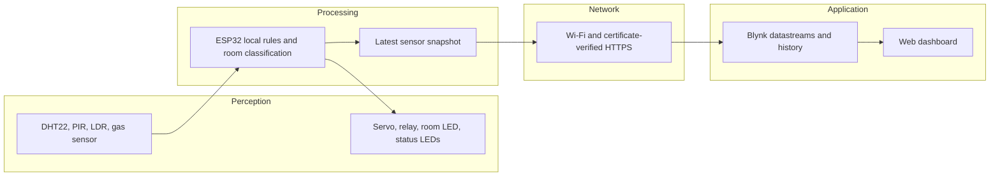

# 3707ICT Smart Room — Blynk setup

This ESP32 project keeps three automation rules on the device and sends measurements and status to Blynk over authenticated HTTPS. The Blynk web dashboard has four gauges, three state indicators, four text/value displays and four history charts (15 widgets total).

## Open the project

- [Live Blynk device dashboard](https://blynk.cloud/dashboard/1159205/global/devices/439359/organization/1159205/devices/4241147/dashboard) (sign in to the account used for setup).
- Template: **3707ICT Smart Room**, ID `TMPL67Jur1hEj`.
- Device: **Smart Room ESP32**.
- [Wokwi circuit](https://wokwi.com/projects/474339307564266497).

The Blynk integration is on the [`blynk-update` branch](https://github.com/NagsaiRambhatla/Automation_And_IoT/tree/blynk-update). The public Wokwi project's editor still contains the original version. The tested Wokwi session loads a locally compiled firmware file, so its editor can show the original source while running the updated firmware.

## Run the updated simulation

1. Check out `blynk-update`. Copy `secrets.example.h` to `secrets.h` and fill in your device's token and regional Blynk server. Keep an existing configured `secrets.h` if you already have one; credentials are not included in the repository.
2. With Arduino CLI and the packages listed below installed, run `./build.ps1` from this repository in PowerShell. It uses `arduino-cli` from your PATH. For a custom installation, pass `-ArduinoCli 'C:\path\to\arduino-cli.exe'` and, if needed, `-ConfigFile 'C:\path\to\arduino-cli.yaml'`.
3. Open the Wokwi circuit, click inside the code editor, press **F1**, and choose **Upload Firmware and Start Simulation…**.
4. Select `build/sketch/build/esp32.esp32.esp32/sketch.ino.merged.bin` from this local repository. This file contains the device token: use it only in a trusted simulator; do not publish it.
5. Keep Wokwi visible in its own browser window. Chrome can slow the simulation considerably when the tab is in the background. You can view Blynk in a second window alongside it.
6. Wait for `Blynk HTTPS upload: OK (HTTP 200)` in the serial monitor. Blynk should show **Online** and matching readings. Stop the simulator when finished.

Reloading Wokwi or pressing its normal build/play action can return to the original public code. Repeat the firmware-upload procedure to run this version. `wokwi.toml` also points to the local build files for an existing Wokwi VS Code setup; that extension is optional.

Build tested with Arduino ESP32 core **3.3.12**, DHT sensor library for ESPx **1.19.0**, ESP32Servo **3.2.1**, and Adafruit NeoPixel **1.15.5**. A fresh toolchain needs those packages installed. Arduino requires a matching sketch directory, so `build.ps1` stages `sketch.ino` and headers under ignored `build/sketch/` before compiling.

## Dashboard channels

Virtual pins identify cloud values, not physical ESP32 pins. All widgets are displays; the target-temperature value is currently set in firmware.

| Pin | Value | Type / range | Display |
| --- | --- | --- | --- |
| V0 | Measured Temperature | Double, -40 to 80 °C | Gauge and temperature history |
| V1 | Humidity | Double, 0 to 100 % | Gauge |
| V2 | Light Level | Integer, 0 to 4095 | Gauge and raw history |
| V3 | Smoke Level | Integer, 0 to 4095 | Gauge and raw history |
| V4 | Occupied | Integer, 0/1 | Indicator |
| V5 | Light On | Integer, 0/1 | Indicator |
| V6 | Climate Mode | String | Standby / Cooling / Heating / Sensor fault |
| V7 | Window Open | Integer, 0/1 | Indicator |
| V8 | Simulated Temperature | Double, -40 to 80 °C | Label and temperature history |
| V9 | Target Temperature | Double, 16 to 40 °C; default 38 | Label |
| V10 | Room State | String | Rule-based room assessment |

Numeric history uses **1 Minute AVG**. A chart needs completed averaging intervals; allow several minutes, then reselect **1h** to refresh stored history. The light/smoke chart uses raw ADC units rather than lux or calibrated gas concentration. Live values expire after one minute without a new reading. Connection Lifecycle logs incoming reports as Online and marks the device Offline after one minute without reports; the server may take a little longer to display the change.

The firmware sends a batch every 30 seconds, plus extra batches when occupancy, light, smoke or sensor validity changes (at least two seconds between attempts). This prevents short occupancy signals falling between periodic uploads. A healthy connection may still take several seconds to complete HTTPS. Continuous periodic reporting alone uses approximately 86,400 messages per 30 days; state changes add more. The account showed a 100,000-message allowance during setup. Use it for demos or adjust the interval for continuous deployment.

## Automation and intelligence

| Rule | Input and decision | Output / control classification |
| --- | --- | --- |
| Climate | Simulated room temperature outside target ±1 °C starts heating/cooling; stop at target | Relay on while active. Closed loop around a **software temperature model**, not a validated physical HVAC loop. |
| Lighting | Motion implies occupied; retain occupancy for ten seconds after the last HIGH input. If occupied and light ADC ≥2000, turn on the room light | Bulb LED. Feed-forward/rule-based actuation; the circuit does not measure the lamp's effect on room illumination. |
| Smoke | Smoke ADC ≥2000 | Servo goes to 0° (window open); otherwise 100° (closed). Threshold-triggered open-loop actuation, with no position feedback. |

`roomAssessment()` combines temporal occupancy inference with light, smoke and sensor validity. Its priority is **Smoke alert → Climate sensor fault → Room empty → Occupied and dark → Occupied and bright**. This is the project's explicit rule-based edge intelligence feature; explain the inputs, priority and test scenarios in the report.

The existing 38 °C target was retained for the simulation. Measured and simulated temperatures are deliberately displayed separately. The software model changes by 0.5 °C each two-second climate cycle and drifts toward measured ambient temperature while idle. It is not evidence of real heating or cooling.

## Four-layer architecture

The ESP32 samples motion/light/smoke approximately every 100 ms and climate every two seconds. A separate FreeRTOS task sends the latest snapshot so slow networking does not block local automation. There is no offline history buffer: after a connection gap, the next successful request reports current values.

## Security and fault behaviour

- HTTPS verifies the Blynk server certificate using the ISRG Root X1 CA in `cloud_ca.h`. NTP supplies a usable date for certificate validation. Certificate verification is never disabled.
- Each request uses a device token from private `secrets.h`. URLs and tokens are not printed to the serial monitor. `.gitignore` excludes credentials and compiled artifacts, including staged build copies.
- Invalid DHT readings switch the climate relay off and reset the model so it can recover on a valid reading. Invalid numeric readings are omitted from uploads; fault text is uploaded and stale widgets expire.
- Status pixels show green for valid climate/lighting/occupancy processing, red for climate faults or smoke, and yellow on the master indicator until a successful cloud upload. Lighting and occupancy pixels are subsystem-health indicators; the separate room LED represents the actual lighting output.
- This is a course prototype. Gas threshold/servo movement is a demonstration rule, not a certified smoke-safety system. Physical hardware, sensor voltage compatibility and real actuator loads require separate validation.

## Repeatable demonstration

1. **Cloud connection:** start the compiled firmware and compare Wokwi readings to Blynk. Observe HTTP 200 and Online.
2. **Climate:** set DHT temperature above 39 °C and below 37 °C. Show measured temperature, the distinct simulated value, relay activity and cooling/heating/standby transitions. Set humidity to a known value and compare the gauge.
3. **Smoke:** change the gas slider until ADC exceeds 2000. Show servo opening, red safety status, Window Open and Smoke alert. Lower gas until ADC is below 2000 and show recovery. If the slider retains an old value after restarting, move it away and back to apply it to the new simulation.
4. **Lighting:** set LDR illumination near minimum (high ADC), then click PIR **Simulate motion**. Show room light, occupancy and Occupied and dark. Allow the PIR pulse to finish and then ten seconds without HIGH input; demonstrate light off and Room empty.
5. **Bright occupied room:** increase illumination until ADC is below 2000 and trigger motion. Occupancy should be true with the room light off and Occupied and bright.
6. **History:** leave the simulation running for a few minutes while changing sensors, then select 1h and show the four charts. Historical values are averages, so they can differ from the latest gauge reading.

Record your own maximum-five-minute demo and include the final architecture, circuit, rules, communication, cloud, security and testing in the maximum-20-page report. Check the course sheet for deadlines and prepare each member for the individual interview. The web dashboard is configured; a separate Blynk mobile layout has not been created.

## References

- [Blynk HTTPS batch updates](https://docs.blynk.io/en/blynk.cloud/device-https-api/update-multiple-datastreams-api)
- [Blynk web dashboards](https://docs.blynk.io/en/blynk.console/templates/dashboard)
- [Blynk message usage](https://docs.blynk.io/en/message-usage)
- [Wokwi custom ESP32 firmware](https://docs.wokwi.com/guides/esp32)
- [Wokwi Wi-Fi](https://docs.wokwi.com/guides/esp32-wifi)
