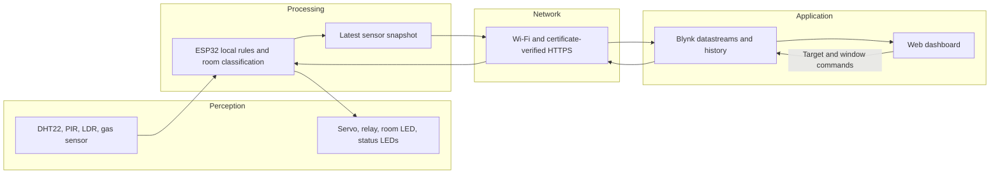

# 3707ICT Smart Room — Blynk setup

This ESP32 project keeps three automation rules on the device and exchanges measurements, status and user settings with Blynk over authenticated HTTPS. The Blynk web dashboard has four gauges, four state indicators, nine text/value displays, two controls and five history charts (24 widgets total).

## Open the project

- [Live Blynk device dashboard](https://blynk.cloud/dashboard/1159205/global/devices/439359/organization/1159205/devices/4241147/dashboard) (sign in to the account used for setup).
- Template: **3707ICT Smart Room**, ID `TMPL67Jur1hEj`.
- Device: **Smart Room ESP32**.
- [Wokwi circuit](https://wokwi.com/projects/474339307564266497).
- [Dashboard handover checklist](HANDOVER.md) and [recorded test results](test-evidence/TEST_RESULTS.md).

The Blynk integration is on the [`blynk-update` branch](https://github.com/NagsaiRambhatla/Automation_And_IoT/tree/blynk-update). The public Wokwi project's editor still contains the original version. The tested Wokwi session loads a locally compiled firmware file, so its editor can show the original source while running the updated firmware.

## Run the updated simulation

1. Check out `blynk-update`. Copy `secrets.example.h` to `secrets.h` and fill in your device's token and regional Blynk server. Keep an existing configured `secrets.h` if you already have one; credentials are not included in the repository.
2. With Arduino CLI and the packages listed below installed, run `./build.ps1` from this repository in PowerShell. It uses `arduino-cli` from your PATH. For a custom installation, pass `-ArduinoCli 'C:\path\to\arduino-cli.exe'` and, if needed, `-ConfigFile 'C:\path\to\arduino-cli.yaml'`.
3. Open the Wokwi circuit, click inside the code editor, press **F1**, and choose **Upload Firmware and Start Simulation…**.
4. Select `build/sketch/build/esp32.esp32.esp32/sketch.ino.merged.bin` from this local repository. This file contains the device token: use it only in a trusted simulator; do not publish it.
5. Keep Wokwi visible in its own browser window. Chrome can slow the simulation considerably when the tab is in the background. You can view Blynk in a second window alongside it.
6. Wait for `Blynk HTTPS upload: OK (HTTP 200)` in the serial monitor. Blynk should show **Online** and matching readings. Stop the simulator when finished.

Reloading Wokwi or pressing its normal build/play action can return to the original public code. Repeat the firmware-upload procedure to run this version. `wokwi.toml` also points to the local build files for an existing Wokwi VS Code setup; that extension is optional.

Build tested with Arduino ESP32 core **3.3.12**, DHT sensor library for ESPx **1.19.0**, ESP32Servo **3.2.1**, Adafruit NeoPixel **1.15.5**, and ArduinoJson **7.4.2**. A fresh toolchain needs those packages installed. Arduino requires a matching sketch directory, so `build.ps1` stages `sketch.ino` and headers under ignored `build/sketch/` before compiling.

## Dashboard channels

Virtual pins identify cloud values, not physical ESP32 pins. V9 and V12 are user commands; the firmware reads them and never overwrites them with telemetry. V18 and V7 report the applied target and actual commanded servo position.

| Pin | Value | Type / range | Display |
| --- | --- | --- | --- |
| V0 | Measured Temperature | Double, -40 to 80 °C | Gauge and temperature history |
| V1 | Humidity | Double, 0 to 100 % | Gauge and humidity history |
| V2 | Light Level | Integer, 0 to 4095 | Gauge and raw history |
| V3 | Smoke Level | Integer, 0 to 4095 | Gauge and raw history |
| V4 | Occupied | Integer, 0/1 | Indicator |
| V5 | Light On | Integer, 0/1 | Indicator |
| V6 | Climate Mode | String | Standby / Cooling / Heating / Sensor fault |
| V7 | Window Open | Integer, 0/1 | Indicator |
| V8 | Simulated Temperature | Double, -40 to 80 °C | Label and temperature history |
| V9 | Target Temperature | Double, 16 to 40 °C; default 38 | Editable number input, 0.5 °C steps |
| V10 | Room State | String | Rule-based room assessment |
| V11 | Relay On | Integer, 0/1 | AC relay indicator (GPIO14) |
| V12 | Window Command | Integer, 0/1; default 0 | CLOSED / OPEN switch (GPIO12 servo) |
| V13 | Climate Status | String | Checking / Fault / Working |
| V14 | Lighting Status | String | Checking / Fault / Working |
| V15 | Occupancy Status | String | Checking / Fault / Working |
| V16 | Safety Status | String | Checking / Fault / Working |
| V17 | Master Status | String | Checking / Fault / Working |
| V18 | Applied Target | Double, 16 to 40 °C | Target acknowledged by ESP32 |

## Using the controls

- **Window / curtains:** ON is OPEN (servo 0°); OFF is CLOSED (servo 100°). The Window Open indicator reports the output. Smoke above the configured threshold forces the window open even when the switch is CLOSED; clearing smoke restores the latest switch choice. Position is commanded, not measured by a feedback sensor.
- **Set target temperature:** click the value to type a number, or use the plus/minus buttons. Wait for Applied Target Temperature to match. The ESP32 polls settings five seconds after each completed read, so network delays can add to the response time. Changes persist on Blynk and are fetched after restart/reconnection.
- **AC relay on** and **Room light on** are displays of the local outputs, not manual override buttons. Climate follows the applied target using the software temperature model; lighting follows occupancy and darkness.
- **System status:** five separate labels correspond to the climate, lighting, occupancy, safety and master pixels. Cloud values are the words Checking, Fault or Working. Internally these map to STATUS_CHECKING=1, STATUS_FAULT=2 and STATUS_OK=0. Lighting/occupancy Working means that the local processing loop is running; these sensors do not provide independent hardware self-test feedback. Master waits for successful uploads and command reads and shows Fault for a climate fault or smoke alarm.

Sensor history uses **1 Minute AVG**. A chart needs completed averaging intervals; allow several minutes, then reselect **1h** to refresh stored history. Temperature and humidity use separate line charts because they have different units. Light/smoke charts use raw ADC units rather than lux or calibrated gas concentration. Telemetry expires after one minute without a new reading; user command streams V9/V12 do not expire. Connection Lifecycle logs incoming reports as Online and marks the device Offline after one minute without reports; the server may take a little longer to display the change.

The firmware sends a batch every 30 seconds, plus extra batches when occupancy, light, window output, relay output, target or system status changes (at least two seconds between attempts). Command reads run separately from local automation in the network worker. HTTPS can take several seconds. Continuous periodic reporting alone sends approximately 86,400 batches per 30 days; state changes and dashboard activity add traffic. The account showed a 100,000-message allowance during setup. Stop simulations after demos and review usage before continuous deployment.

## Automation and intelligence

| Rule | Input and decision | Output / control classification |
| --- | --- | --- |
| Climate | Simulated room temperature outside target ±1 °C starts heating/cooling; stop at target | Relay on while active. Closed loop around a **software temperature model**, not a validated physical HVAC loop. |
| Lighting | Motion implies occupied; retain occupancy for ten seconds after the last HIGH input. If occupied and light ADC ≥2000, turn on the room light | Bulb LED. Feed-forward/rule-based actuation; the circuit does not measure the lamp's effect on room illumination. |
| Smoke / window | Smoke ADC ≥2000 overrides the user's window setting | Servo goes to 0° (open) for smoke or an OPEN command; otherwise 100° (closed). Open-loop actuation, with no position feedback. |

`roomAssessment()` combines temporal occupancy inference with light, smoke and sensor validity. Its priority is **Smoke alert → Climate sensor fault → Room empty → Occupied and dark → Occupied and bright**. This is the project's explicit rule-based edge intelligence feature; explain the inputs, priority and test scenarios in the report.

The initial target is 38 °C until a valid Blynk setting arrives. Measured and simulated temperatures are deliberately displayed separately. The software model changes by 0.5 °C each two-second climate cycle and drifts toward measured ambient temperature while idle. Changing the target re-evaluates heating/cooling without jumping the simulated temperature. This is not evidence of real heating or cooling.

## Four-layer architecture

The ESP32 samples motion/light/smoke approximately every 100 ms and climate every two seconds. A separate FreeRTOS task sends snapshots and reads commands, exchanging data through queues so slow networking does not block local automation. Missing or invalid command values are rejected; the last accepted local settings remain active until valid settings return. There is no offline history buffer: after a connection gap, the next successful request reports current values.

## Security and fault behaviour

- HTTPS verifies the Blynk server certificate using the ISRG Root X1 CA in `cloud_ca.h`. NTP supplies a usable date for certificate validation. Certificate verification is never disabled.
- Each request uses a device token from private `secrets.h`. URLs and tokens are not printed to the serial monitor. `.gitignore` excludes credentials and compiled artifacts, including staged build copies.
- Invalid DHT readings switch the climate relay off and reset the model so it can recover on a valid reading. Invalid numeric readings are omitted from uploads; fault text is uploaded and stale widgets expire.
- Status pixels show green for valid climate/lighting/occupancy processing, red for climate faults or smoke, and yellow on the master indicator until both cloud uploads and command reads are healthy. Lighting and occupancy pixels are subsystem-health indicators; the separate room LED represents the actual lighting output.
- This is a course prototype. Gas threshold/servo movement is a demonstration rule, not a certified smoke-safety system. Physical hardware, sensor voltage compatibility and real actuator loads require separate validation.

## Repeatable demonstration

1. **Cloud connection:** start the compiled firmware and compare Wokwi readings to Blynk. Observe HTTP 200 and Online.
2. **Climate:** set DHT temperature above 39 °C and below 37 °C. Show measured temperature, the distinct simulated value, relay activity and cooling/heating/standby transitions. Set humidity to a known value and compare the gauge.
3. **Smoke:** change the gas slider until ADC exceeds 2000. Show servo opening, red safety status, Window Open and Smoke alert. Lower gas until ADC is below 2000 and show recovery. If the slider retains an old value after restarting, move it away and back to apply it to the new simulation.
4. **Lighting:** set LDR illumination near minimum (high ADC), then click PIR **Simulate motion**. Show room light, occupancy and Occupied and dark. Allow the PIR pulse to finish and then ten seconds without HIGH input; demonstrate light off and Room empty.
5. **Bright occupied room:** increase illumination until ADC is below 2000 and trigger motion. Occupancy should be true with the room light off and Occupied and bright.
6. **Remote window:** with smoke clear, switch OPEN and CLOSED. Show the servo and Window Open indicator following both commands. Set CLOSED, raise smoke, and show that smoke opens the window; clearing smoke restores CLOSED.
7. **Remote target:** enter a new target (for example 24.5 °C), wait for Applied Target to match, and show the changed climate direction and AC relay state. Restore a suitable target after testing.
8. **System status:** show all five labels Working with smoke clear and a healthy climate sensor; smoke changes Safety and Master to Fault. Master is Checking while cloud communication is not healthy.
9. **History:** leave the simulation running for a few minutes while changing temperature and humidity, then select 1h and show their line charts. Historical values are averages, so they can differ from the latest gauge reading.

Record your own maximum-five-minute demo and include the final architecture, circuit, rules, communication, cloud, security and testing in the maximum-20-page report. Check the course sheet for deadlines and prepare each member for the individual interview. The web dashboard is configured; a separate Blynk mobile layout has not been created.

## References

- [Blynk HTTPS batch updates](https://docs.blynk.io/en/blynk.cloud/device-https-api/update-multiple-datastreams-api)
- [Blynk HTTPS command reads](https://docs.blynk.io/en/blynk.cloud/device-https-api/get-multiple-datastream-values)
- [Blynk web dashboards](https://docs.blynk.io/en/blynk.console/templates/dashboard)
- [Blynk message usage](https://docs.blynk.io/en/message-usage)
- [Wokwi custom ESP32 firmware](https://docs.wokwi.com/guides/esp32)
- [Wokwi Wi-Fi](https://docs.wokwi.com/guides/esp32-wifi)
